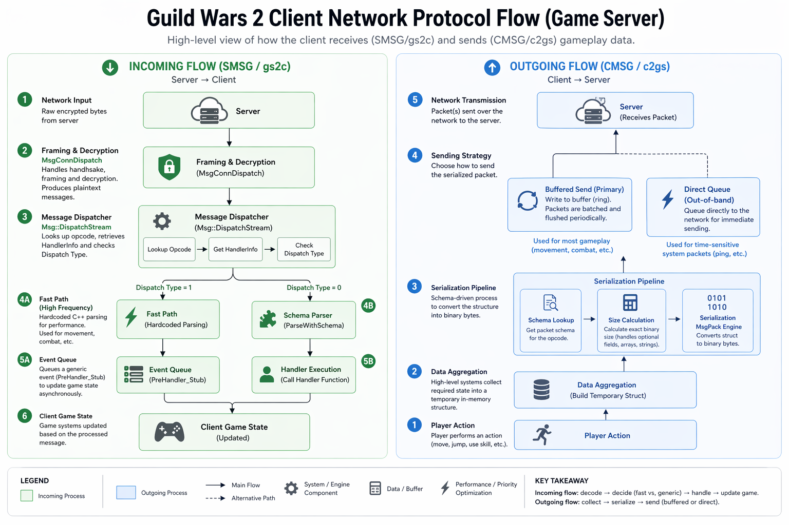

# Welcome

Welcome to the official documentation for the KX Packet Inspector project.

This repository aims to provide a powerful tool for understanding and analyzing network communication in Guild Wars 2. This documentation serves as a central hub for all reverse engineering findings, methodologies, and technical insights gained during the development of this tool.

---

## What's Inside This Documentation?

*   **Complete Protocol Breakdowns:** Detailed, evidence-backed analysis of the three core network protocols:
    *   **Game Server (`gs2c`/`c2gs`):** The primary protocol for all real-time gameplay.
    *   **Login Server (`ls2c`/`c2ls`):** The initial authentication and character select protocol.
    *   **Platform/Portal Server (`ps2c`/`c2ps`):** The protocol for account-wide services like the trading post.
*   **Reverse Engineering Playbooks:** Step-by-step guides and methodologies for discovering and analyzing the game client, allowing you to replicate or extend this research.
*   **Engine Internals:** Deep dives into non-networking systems, including the engine's runtime reflection system.
*   **Architectural Evidence:** A comprehensive library of raw decompiled C code snippets that serve as the primary source evidence for all analysis.

---

## Where to Start?

*   For a high-level overview of how the game's networking is structured, start with the **[System Architecture](./system-architecture.md)**.
*   To find a specific packet definition, see the main **[Network Protocol Reference](./protocols/)**.
*   To learn how this information was discovered, consult the **[Reverse Engineering Methodologies](./methodologies/)**.

---

## Network Protocol Flow Diagram

For a high-level visual overview of the client's network communication with the Game Server, refer to the diagram below:

